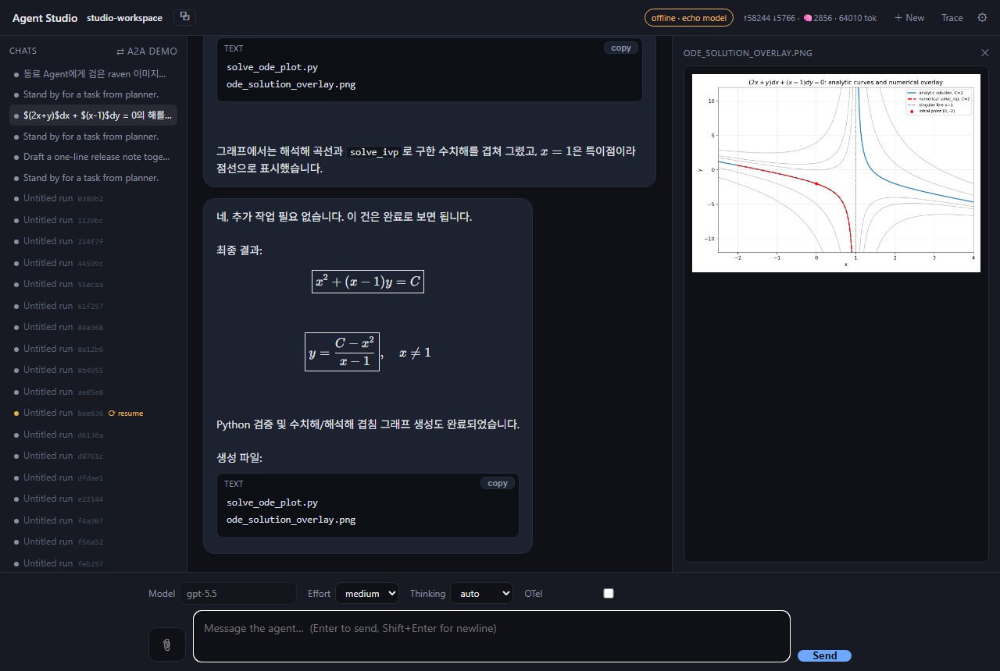
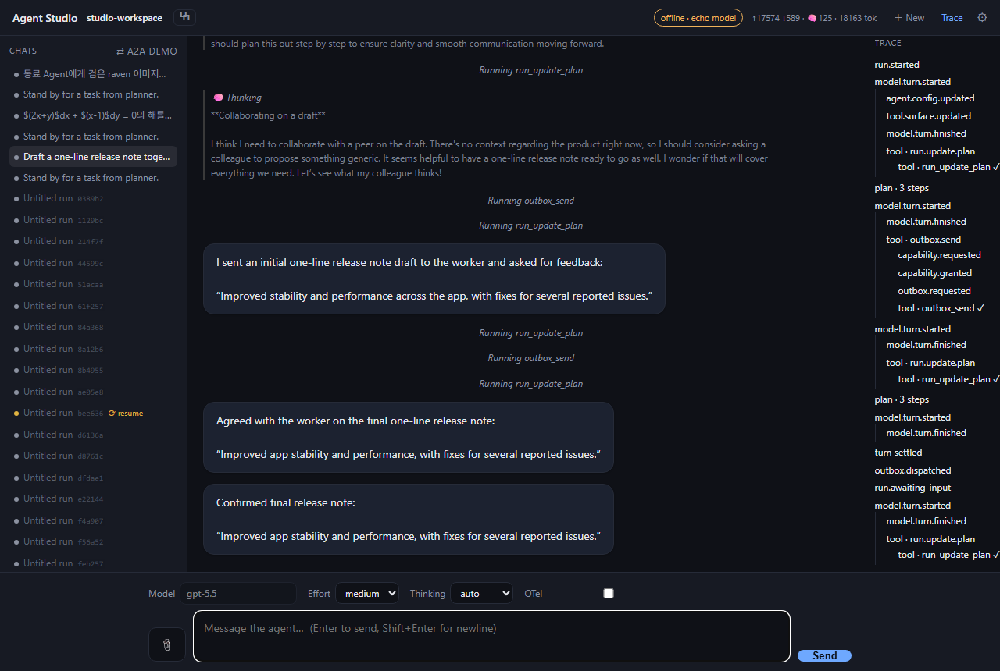

# Monoid Agent Kernel

*A lightweight durable agent kernel for embedding product-grade agents anywhere: contract-first, observable, permission-aware, and replaceable at every seam.*

[](https://github.com/hoonseokyoon/monoid-agent-kernel/actions/workflows/ci.yml)
[](LICENSE)
[](pyproject.toml)

Monoid is the small runtime core you put inside a larger product when you need
agents to run reliably. It owns the loop, durable artifacts, tool execution,
permissions, observability, subagents, skills, and gateway contracts while leaving
deployment choices to your platform. Models, tools, workspace storage, checkpoint
stores, event sinks, capability brokers, memory, and gateway services are all
replaceable contracts.

> Throughout these docs, **"your gateway" / "your backend platform"** refers to the
> backend you operate — the credential boundary that hosts the LLM and Web gateways. The
> kernel never holds provider keys; it calls your gateway with a short-lived, scoped token.

## See it run

The bundled **Agent Studio** reference app (`monoid studio serve`) drives the kernel
through its Python API behind a single-page UI.



*A real agent — it plans, writes and runs code in a workspace, and reports back; every step is
observable, and generated output (here, a plot) previews inline.*



*Two independently-configured agent profiles, running on one kernel, collaborate by passing
messages over a durable, capability-gated **outbox→inbox** fabric — the capability and outbox
events are visible in the trace on the right.*

## Architecture: Contract / Conformance Test / Core Helper Kit / Reference

The package is organized around four roles:

- **Contract** — the stable integration surface, collected in `monoid_agent_kernel.contracts`
  and re-exported from the top-level `monoid_agent_kernel`. These are the specs and protocols you
  depend on and implement: `AgentLoop`, `AgentRunSpec`, `AgentRuntimeConfig`, `ModelAdapter`,
  `ToolSpec` / `@tool`, `EventSink`, `CheckpointStore`, `PermissionPolicy`, and the rest. See
  [docs/CONTRACTS.md](docs/CONTRACTS.md) for the Python, HTTP, wiring, and operational rules.
- **Conformance Test** — profile-based tests that check contract behavior for a chosen runtime
  shape. See [docs/CONFORMANCE.md](docs/CONFORMANCE.md) for the profile model and
  [docs/OPERATIONAL_RULE_COVERAGE.md](docs/OPERATIONAL_RULE_COVERAGE.md) for the
  rule-to-test and Phase 2S hardening coverage matrix.
- **Core Helper Kit** — the supported runtime and helper modules that make the contract easy to
  satisfy (`loop.py`, `core/`, `providers/`, `tools/`, `workspace/`, …). See
  [docs/CORE_HELPER_KIT.md](docs/CORE_HELPER_KIT.md) for the helper boundary and
  validation/library policy.
- **Reference** — example services under `monoid_agent_kernel.reference` (`backend`,
  `llm_gateway`, `web_gateway`, `mcp_gateway`, `stores`, `studio`, `conformance`) assembled from
  the public contract and helper kit. See [docs/REFERENCE.md](docs/REFERENCE.md) for the reference
  role, harnesses, and smoke targets.

For the dynamic binding-based tool surface, see
[docs/TOOL_SURFACE.md](docs/TOOL_SURFACE.md).

## Install

```bash
pip install monoid-agent-kernel
```

Core has no provider SDK dependency. The direct OpenAI adapter is for local smoke tests;
hosted/product runs use `GatewayModelAdapter` through your gateway:

```bash
pip install "monoid-agent-kernel[openai]"
```

## Quickstart (no servers)

The smallest kernel run needs three of your objects — a spec, a model adapter, and a runtime
config — and `from_config` wires them in one call. `FakeModelAdapter` (a scripted model)
makes the first turn run offline, with no gateway or API key:

```python
from monoid_agent_kernel import AgentLoop, AgentRunSpec, AgentRuntimeConfig, RegistryToolRef, ToolBinding
from monoid_agent_kernel.providers.base import ModelTurn
from monoid_agent_kernel.providers.fake import FakeModelAdapter

spec = AgentRunSpec(workspace_root="./workspace", mode="apply")
config = AgentRuntimeConfig(
    definition_id="quickstart",
    tools=(ToolBinding(binding_id="fs.write", ref=RegistryToolRef("fs.write")),),
)
adapter = FakeModelAdapter(turns=[ModelTurn(final_text="done")])

result = AgentLoop.from_config(spec, adapter, config).run_once("Summarize notes.md")
```

`from_config`'s `runtime_config` accepts a bare `AgentRuntimeConfig`, a
`RuntimeConfigProvider`, or a `callable(run_id) -> AgentRuntimeConfig` (hot-reload). See
[`examples/minimal_quickstart.py`](examples/minimal_quickstart.py) for a complete file and
[`examples/custom_model_adapter.py`](examples/custom_model_adapter.py) for implementing
your own `ModelAdapter`. Author tools from typed functions with the `@tool` decorator
(see [`examples/custom_tools/word_count_tool.py`](examples/custom_tools/word_count_tool.py));
`generated_tool_bindings(...)` then turns a set of `ToolSpec`s into bindings.

## Stability

This package is pre-1.0 (`0.x`): the public surface may change between minor versions, but
breaking changes are called out in commit messages and this README.

- **Stable Contract** — the core engine and integration contracts exported from
  `monoid_agent_kernel.contracts`: `AgentLoop`, `AgentRunSpec`, `AgentRuntimeConfig` /
  `RuntimeConfigProvider`, `ModelAdapter`, `ToolSpec` / `@tool`, `EventSink`,
  `CheckpointStore`, `Workspace` / `workspace_factory`, and `PermissionPolicy`.
- **Contract Extension** — surfaces that are public but still settling: async task seams,
  session lifecycle/control, capability leases, agent-as-tool delegation, Agent Skills,
  output validation, and multimodal content parts. `ImagePart` and `DocumentPart` are
  forwarded to multimodal-capable adapters. `AudioPart` / `VideoPart` are exported
  content contracts and round-trip through core JSON/checkpoint paths; provider forwarding
  is still adapter-specific.
- **Helper Kit** — implementation helpers live under explicit modules such as
  `monoid_agent_kernel.core.*`, `monoid_agent_kernel.providers.*`,
  `monoid_agent_kernel.tools.*`, `monoid_agent_kernel.recorder`, and
  `monoid_agent_kernel.observability`.
- **Reference examples** — everything under `monoid_agent_kernel.reference.*` is example
  implementation code; build production services against the contracts.

Agent configuration is centered on `AgentDefinition` (the reusable blueprint) and the
mutable `AgentRuntimeConfig` (the current prompt and `ToolBinding` set). Backends can replace
runtime config mid-run; the kernel applies it at the next turn boundary.

## Run

```bash
monoid run \
  --workspace examples/workspaces/edit_markdown_notes \
  --instruction "Read notes.md and create a clearer summary in SUMMARY.md." \
  --runtime-config-file examples/runtime-config.json \
  --llm-gateway-url http://127.0.0.1:8080/internal/llm/turns
```

Run spec and runtime config are separate. `AgentRunSpec` carries workspace,
limits, and permission boundary values — it no longer carries the instruction,
which is delivered as the first user turn (CLI `--instruction`, or
`AgentLoop.run_once()` / `submit()` programmatically). `AgentRuntimeConfig`
carries model, prompt, tool bindings, guidance, scope, quota, shell runtime, and
web runtime values. You can pass a run spec JSON file with a runtime config
file:

```bash
monoid run \
  --spec examples/run-spec.json \
  --instruction "Read notes.md and create a clearer summary in SUMMARY.md." \
  --runtime-config-file examples/runtime-config.json
```

Use the builder CLI to scaffold and preflight those files:

```bash
monoid builder init --target ./my-agent
monoid builder config validate \
  --runtime-config-file ./my-agent/runtime-config.json
monoid builder tools list \
  --runtime-config-file ./my-agent/runtime-config.json
```

`monoid builder init --custom-tool-template` also writes a small `tools.py` provider.
Pass it explicitly when validating or running custom tools:

```bash
monoid builder tools list \
  --tool-module ./my-agent/tools.py:get_tools \
  --runtime-config-file ./my-agent/runtime-config.json
```

Programmatic callers drive the run with `AgentLoop.run_once(instruction)` for the
one-shot case, or `open()` → `submit(user_input)`* → `close()` for a multi-turn
session in a single run. Each `submit()` settles when the model returns final
text with no tool calls; the workspace and model continuation thread across
submits. `commit_checkpoint()` re-baselines the proposal between turns when you
want incremental apply.

The default mode is `propose`, which means the kernel creates a proposal package
without committing to tenant source-of-truth storage. Local CLI runs default to
`--workspace-backend overlay`, so writes are staged in an overlay and emitted as
`runs/<run_id>/diff.patch` and `runs/<run_id>/proposal.json` without modifying
the workspace. Container/hosted runs can use `--workspace-backend staging`,
where tools and shell write directly to a staging workspace and the kernel
compares that workspace with `workspace.base.json` to generate the proposal.
Use `--mode apply` for local direct workspace writes.

### Custom workspace backend

Monoid never touches the filesystem directly — it works through a `Workspace`
(the file-storage surface in `monoid_agent_kernel.contracts`). `AgentLoop` builds one
per run with `workspace_factory(spec)`, defaulting to `default_local_workspace_factory`,
which returns the local-filesystem backend. Supply your own factory to back a run with a
different store — a git worktree, an object store, a remote or in-memory filesystem —
without changing the engine:

```python
from monoid_agent_kernel import AgentLoop, Workspace

def my_workspace_factory(spec) -> Workspace:
    return MyWorkspace(spec.workspace_root, mode=spec.mode)

loop = AgentLoop.from_config(spec, adapter, config, workspace_factory=my_workspace_factory)
```

A custom backend must honor the `Workspace` contract suite
(`tests/test_workspace_contract.py`) to be a drop-in: add one `pytest.param` for your
factory and the existing invariants run against it.

The default model provider is `gateway`. Hosted runs should call an internal
LLM gateway with a short-lived run token. The kernel should not receive
OpenAI, Anthropic, or other provider API keys.

Web tools are also gateway-backed. `web.search`, `web.fetch`, and `web.context`
are available when runtime config binds those registry tools. The kernel calls
your WebGateway with a short-lived `web_gateway` token. The kernel does not
perform direct web egress and does not receive search-provider credentials.
`web.context` returns
LLM-ready grounding context through a provider-neutral ContextProvider contract.

Shell is available when runtime config binds `shell.exec`, which supports foreground
commands and run-scoped background jobs. A background call returns a `job_id` immediately;
the kernel feeds the job's result back to the model when it finishes (inspect jobs with the
`jobs` / `job` CLI commands below).

Path permission defaults are permissive: the kernel treats every root-contained file as a
normal workspace file, including dotfiles and keys. Backends can explicitly deny or redact
paths per run:

```bash
monoid run \
  --workspace examples/workspaces/edit_markdown_notes \
  --instruction "Inspect this workspace." \
  --runtime-config-file examples/runtime-config.json \
  --deny-path ".env" \
  --redact-path "*.key"
```

`--permission-policy-file policy.json` accepts:

```json
{
  "deny_patterns": [".env", "*.key"],
  "redact_patterns": ["internal/**"]
}
```

`deny_patterns` blocks tool and shell access. `redact_patterns` masks paths in the public
event/status stream only; private run artifacts keep real paths and contents.

Public events keep file content out of the stream and mask `redact_patterns` paths.
Your backend owns any extra redaction for secret-bearing tool arguments or shell commands
(see [Event Sinks](#event-sinks)).

### Subagents, Skills, and capability gating

Three optional features on `monoid run`, each off unless its flag is set:

- `--agents-directory DIR` — load subagent definitions (`*.md` with frontmatter) from
  `DIR`, enabling the `agent.spawn` tool so the model can delegate to isolated child runs.
- `--skills-directory DIR` — load Agent Skills (`SKILL.md` with frontmatter) from `DIR`,
  enabling the progressive-disclosure skill tools.
- `--capability-broker path.py:factory` — load a `CapabilityBroker` that gates any tool
  declaring `runtime.requires_lease` behind a scoped, short-lived lease. Required leases fail
  closed when no broker is configured. For local dev, `--auto-grant-capabilities` uses the built-in
  `AutoGrantBroker` (grants every request, scoped to its binding) instead. Pass at most one of the
  two.

For machine-readable real-time progress:

```bash
monoid run \
  --workspace examples/workspaces/edit_markdown_notes \
  --instruction "Read notes.md and create a clearer summary in SUMMARY.md." \
  --runtime-config-file examples/runtime-config.json \
  --llm-gateway-url http://127.0.0.1:8080/internal/llm/turns \
  --stream-json
```

`--stream-json` writes public redacted events to stdout as JSON Lines. Human
status output goes to stderr in this mode.

## Watch

Replay or follow a run's public event stream:

```bash
monoid watch <run_id> --run-root ./runs --from-start --json
monoid watch <run_id> --run-root ./runs --follow
```

`--json` prints raw JSONL events. The default watch output is a compact human
view.

Inspect the current proposed output snapshot:

```bash
monoid proposal <run_id> --run-root ./runs
monoid proposal <run_id> --run-root ./runs --file SUMMARY.md --json
```

Inspect background shell jobs and logs:

```bash
monoid jobs <run_id> --run-root ./runs
monoid job status <job_id> --run <run_id> --run-root ./runs --json
monoid job logs <job_id> --run <run_id> --stream stdout --tail-bytes 4096
monoid job cancel <job_id> --run <run_id>
```

## Backend (reference)

> Reference example (`monoid_agent_kernel.reference.backend`). Build production backends against
> the contracts in [docs/CONTRACTS.md](docs/CONTRACTS.md).

The reference backend issues run tokens, starts kernel runs, and exposes lifecycle,
result, event, and tenant usage APIs. Lifecycle payloads use `state` plus `terminal`;
ready result payloads keep `status` for the terminal `AgentRunResult.status`.
Provider API keys stay outside the Monoid backend.

Start a local LLM gateway. This process is the provider-credential boundary:

```bash
export MONOID_BACKEND_ADMIN_TOKEN="admin-dev-token"
export MONOID_LLM_GATEWAY_ADMIN_TOKEN="llm-admin-dev-token"
export MONOID_BACKEND_TOKEN_SECRET="replace-with-32-plus-random-bytes"

monoid llm-gateway serve \
  --host 127.0.0.1 \
  --port 8080
```

Start the Monoid backend in another process. It shares the token signing secret
with the LLM and Web gateways so it can issue scoped gateway tokens:

Reference gateway tokens include a `kid` header. The shared `TokenManager` supports keyring-based
rotation with a grace window plus token-id and issued-before revocation checks.

```bash
monoid backend serve \
  --workspace-root /workspaces \
  --run-root ./runs \
  --llm-gateway-url http://127.0.0.1:8080/internal/llm/turns \
  --web-gateway-url http://127.0.0.1:8090
```

For local contract testing, start the reference fake WebGateway:

```bash
export MONOID_WEB_GATEWAY_ADMIN_TOKEN="web-admin-dev-token"

monoid web-gateway serve \
  --host 127.0.0.1 \
  --port 8090 \
  --provider fake
```

For a real search smoke, use Brave Search for `web.search` and the gateway's
direct HTTP fetcher for `web.fetch`. Add `--context-provider brave-llm` to use
Brave's LLM Context endpoint for `web.context`, or `--context-provider
search-fetch` to build context from the configured search/fetch providers.
Provider credentials stay in the WebGateway process and are never passed to Monoid:

```bash
export BRAVE_SEARCH_API_KEY="..."

monoid web-gateway serve \
  --host 127.0.0.1 \
  --port 8090 \
  --provider brave-http \
  --context-provider brave-llm \
  --brave-api-key-env BRAVE_SEARCH_API_KEY
```

Create a run:

```bash
curl -sS -X POST http://127.0.0.1:8765/v1/runs \
  -H "Authorization: Bearer $MONOID_BACKEND_ADMIN_TOKEN" \
  -H "Content-Type: application/json" \
  -d '{
    "tenant_id": "tenant_a",
    "user_id": "user_a",
    "workspace_root": "/workspaces/demo",
    "instruction": "Read notes.md and create SUMMARY.md.",
    "mode": "propose",
    "runtime_config": {
      "definition_id": "markdown-editor",
      "config_version": 1,
      "model": {"provider": "gateway", "model": "gpt-5.5"},
      "tools": [
        {"binding_id": "read_file", "ref": {"kind": "registry", "tool_id": "fs.read"}},
        {"binding_id": "write_file", "ref": {"kind": "registry", "tool_id": "fs.write"}},
        {"binding_id": "finish", "ref": {"kind": "registry", "tool_id": "run.finish"}}
      ],
      "tool_search": {"enabled": true, "top_k": 5}
    }
  }'
```

The response includes a `run_token`. Use that token for:

```bash
curl -H "Authorization: Bearer $RUN_TOKEN" \
  http://127.0.0.1:8765/v1/runs/$RUN_ID/status

curl -H "Authorization: Bearer $RUN_TOKEN" \
  http://127.0.0.1:8765/v1/runs/$RUN_ID/result

curl -H "Authorization: Bearer $RUN_TOKEN" \
  http://127.0.0.1:8765/v1/runs/$RUN_ID/events

curl -H "Authorization: Bearer $RUN_TOKEN" \
  "http://127.0.0.1:8765/v1/runs/$RUN_ID/events?from_seq=1&limit=100"

curl -H "Authorization: Bearer $RUN_TOKEN" \
  "http://127.0.0.1:8765/v1/runs/$RUN_ID/diagnostics?event_limit=50"

curl -H "Authorization: Bearer $RUN_TOKEN" \
  http://127.0.0.1:8765/v1/runs/$RUN_ID/proposal

curl -H "Authorization: Bearer $RUN_TOKEN" \
  http://127.0.0.1:8765/v1/runs/$RUN_ID/proposal/files/SUMMARY.md

curl -H "Authorization: Bearer $RUN_TOKEN" \
  http://127.0.0.1:8765/v1/runs/$RUN_ID/runtime-config

# POST replaces the run's config (optimistic concurrency via expected_version); the kernel
# applies it at the next turn boundary. See docs/CONTRACTS.md for the request schema.
curl -sS -X POST http://127.0.0.1:8765/v1/runs/$RUN_ID/runtime-config \
  -H "Authorization: Bearer $RUN_TOKEN" \
  -H "Content-Type: application/json" \
  -d @new-runtime-config.json

curl -H "Authorization: Bearer $RUN_TOKEN" \
  http://127.0.0.1:8765/v1/runs/$RUN_ID/jobs

curl -H "Authorization: Bearer $RUN_TOKEN" \
  http://127.0.0.1:8765/v1/runs/$RUN_ID/jobs/$JOB_ID/logs?stream=stdout
```

`/status` returns lifecycle state, for example `{"state":"running","terminal":false}`.
`/result` returns `ready=false` with lifecycle state while a run is open; when `ready=true`,
its `status` field is the terminal result status (`completed`, `failed`, or `limited`).

Tenant usage is admin-scoped:

```bash
curl -H "Authorization: Bearer $MONOID_BACKEND_ADMIN_TOKEN" \
  http://127.0.0.1:8765/v1/tenants/tenant_a/usage
```

The backend generates a separate `llm_gateway` token for the kernel-to-gateway
call. That token is passed only to `GatewayModelAdapter` and is not returned from
the run APIs. For web-enabled runs, it also generates a separate `web_gateway`
token for `WebGatewayClient`.

The LLM gateway validates `llm_gateway` tokens, calls the provider adapter, and returns only
opaque `turn_handle` values to the kernel. The default by-value `messages` request is
forwarded statelessly; for handle-based continuation it stores provider continuation ids
server-side. The turn request carries the effective model from runtime config. Its usage endpoint is
admin-scoped:

```bash
curl -H "Authorization: Bearer $MONOID_LLM_GATEWAY_ADMIN_TOKEN" \
  http://127.0.0.1:8080/internal/llm/tenants/tenant_a/usage
```

The WebGateway validates `web_gateway` tokens, enforces signed token scope for brokered web
capabilities before calling a provider, and reports tenant usage. Payload-level domain, binding,
and call-limit values can narrow the signed scope; they cannot widen it. The reference ships a
deterministic fake provider plus Brave-backed search/fetch/context providers behind the
provider-neutral `ContextProvider` seam, so the search backend can be swapped without
changing kernel tools.

```bash
curl -H "Authorization: Bearer $MONOID_WEB_GATEWAY_ADMIN_TOKEN" \
  http://127.0.0.1:8090/internal/web/tenants/tenant_a/usage
```

## Outputs

Each run writes:

- `events.jsonl`: public redacted event stream
- `transcript.jsonl`: private debug/replay transcript with full tool payloads
- `status.json`: latest run lifecycle projection for polling (`state` plus `terminal`)
- `metrics.json`: final counters and timing
- `manifest.json`: run contract, agent config metadata, binding-aware tool surface, workspace backend
- `workspace.base.json`: base snapshot used for proposal comparison
- `workspace.index.json`: context/index artifact
- `diff.patch`: proposed or applied workspace diff
- `proposal.json`: proposed output snapshot metadata
- `proposal/files/`: materialized changed-file snapshots
- `artifacts/jobs/<job_id>/`: background job status (`job.json`) and `stdout.log` / `stderr.log`

`events.jsonl` remains public/redacted. Proposed file contents are exposed only
through the run directory snapshot or run-token protected backend proposal APIs.

## Event Sinks

Programmatic callers can pass sinks to
`AgentLoop(..., runtime_config_provider=provider, event_sinks=(...))`.
CLI callers can load sinks with:

```bash
monoid run \
  --workspace . \
  --instruction "Inspect this workspace." \
  --runtime-config-file examples/runtime-config.json \
  --event-sink-module ./my_sink.py:make_sink
```

The function must return an object with `emit(event)` and `close()` methods, or
an iterable of those objects.

`examples/redacting_event_sink.py` is a ready-to-copy sink that masks
secret-looking values before forwarding — the recommended place to add secret
redaction now that the core no longer guesses at secrets (see above):

```bash
monoid run \
  --workspace . \
  --instruction "Inspect this workspace." \
  --runtime-config-file examples/runtime-config.json \
  --llm-gateway-url http://127.0.0.1:8080/internal/llm/turns \
  --event-sink-module examples/redacting_event_sink.py:make_sink
```

## Observability

Every run emits a structured event stream and a metrics artifact, and can mirror that stream to
OpenTelemetry — all without the core capturing prompt/response content.

**OpenTelemetry tracing.** `OtelEventSink` is an event sink that turns the run's
`run → model.turn → tool.call` event tree into a GenAI-semantic-convention span tree:

```
invoke_agent
├── chat {model}          (one span per model turn)
└── execute_tool {tool}   (one span per tool call)
```

`chat` and `execute_tool` are siblings under `invoke_agent` (linked by a `turn_id` attribute,
not nested), and spans carry GenAI attributes (`gen_ai.operation.name`, `gen_ai.request.model`,
`gen_ai.tool.name`, token usage). Wire it in with one line:

```python
from monoid_agent_kernel import AgentLoop
from monoid_agent_kernel.observability.otel import OtelEventSink

loop = AgentLoop.from_config(spec, adapter, config, event_sinks=(OtelEventSink(),))
```

`OtelEventSink` depends only on `opentelemetry-api` (a no-op until your app installs an SDK +
exporter). To actually export spans, install the SDK and an OTLP exporter and configure a global
`TracerProvider`:

```bash
pip install "monoid-agent-kernel[otel-export]"
```

[`examples/otel_tracing.py`](examples/otel_tracing.py) is a runnable, offline demo: it prints the
span tree to the console (via a local `ConsoleSpanExporter`, no collector) for a scripted run.

**Live streaming.** Beyond the durable event sinks, `AgentLoop.astream(user_input)` returns a
`RunStream` — an async context manager + iterator that yields `AgentEvent` (orchestration)
interleaved with `ModelStreamChunk` (token deltas: `TextDelta` / `ReasoningDelta` /
`ToolCallDelta` / `TurnComplete`) when the adapter exposes `astream_turn`. Read `stream.result`
after the stream drains. Gateway token streaming uses Server-Sent Events and needs the
`[http-async]` extra.

**Metrics.** Each run writes `metrics.json` (and emits a `metrics.updated` event per turn) with
final counters and timing: `status`, `duration_s`, `tool_calls`, shell/background-job counters,
web-call counters, and token usage (`input_tokens`, `output_tokens`, `total_tokens`,
`reasoning_tokens`). See [Outputs](#outputs) for the full run-directory artifact set.

See also the design docs under [`docs/`](docs/README.md): `SUBAGENT_DESIGN.md` and
`SKILLS_DESIGN.md` for the delegation and skills surfaces.

## Model Provider Boundary

`GatewayModelAdapter` is the default path. It sends normalized model-turn
requests to your LLM gateway and can authenticate with
`MONOID_LLM_GATEWAY_TOKEN` or `--llm-gateway-token-file`. Provider credentials stay
inside your backend platform, where tenant usage, budgets, and rate limits
can be enforced.

`OpenAIModelAdapter` is retained for local smoke tests. CLI use requires
`runtime_config.model.provider="openai"` and `--allow-direct-provider-api`.

To target your own LLM gateway, implement the `ModelAdapter` protocol or the
`monoid.llm-turn.v1` HTTP contract documented in
[docs/CONTRACTS.md](docs/CONTRACTS.md). Current protocol and schema identifiers
use `monoid.*`; `native-agent-runner.*` identifiers are accepted during migration
for existing durable artifacts and gateway requests.

## Defaults

- runtime config is required for CLI and backend runs
- default model provider inside `ModelConfig`: `gateway`
- default model inside `ModelConfig`: `gpt-5.5`
- default reasoning effort inside `ModelConfig`: `medium`
- mode: `propose`
- shell is available only through an exposed `shell.exec` binding
- web.search/web.fetch/web.context are available only through exposed web bindings and WebGateway
- file mutation tools include write, patch, mkdir, copy, move, and delete in
  `propose` and `apply` modes when bound in runtime config
- no path deny/redact policy unless explicitly provided

## Contributing

Issues and pull requests are welcome. See [CONTRIBUTING.md](CONTRIBUTING.md) for
development setup and the lint/test workflow, and [CODE_OF_CONDUCT.md](CODE_OF_CONDUCT.md).
For security issues, follow [SECURITY.md](SECURITY.md) (do not open a public issue).

Fast local confidence checks:

```bash
python -m pytest tests/conformance -q
python -m pytest -q -n 4
python -m pytest -q --cov=monoid_agent_kernel --cov=native_agent_runner
```

CI keeps the serial suite as the required gate and runs xdist plus coverage as
advisory checks while the test seams stabilize.

## License

Licensed under the [Apache License 2.0](LICENSE).
