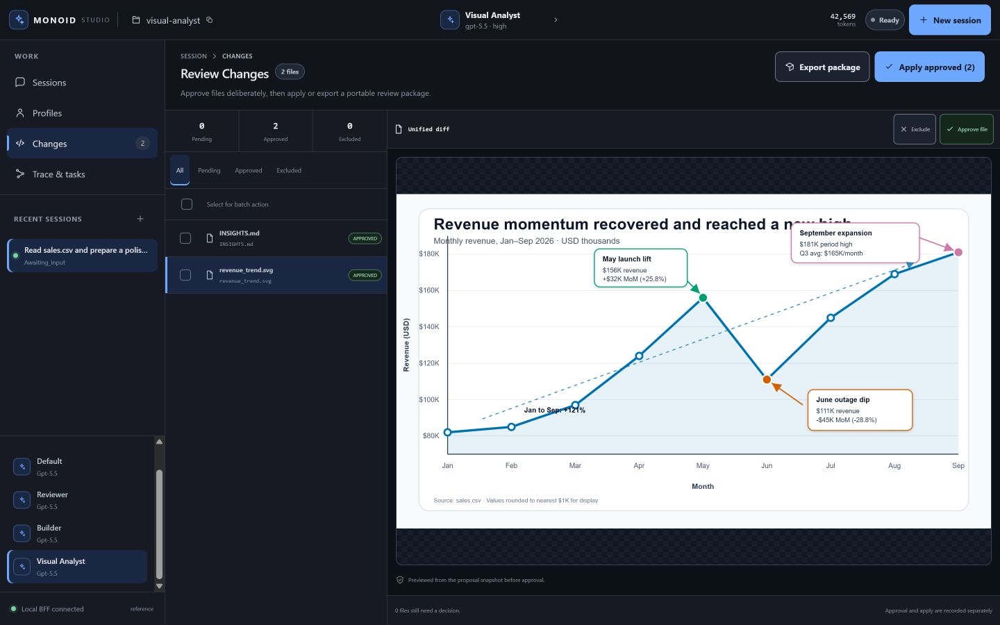

# Agent Studio (reference app)

Agent Studio is the bundled "installable agent app" — it boots the reference LLM gateway, Monoid
backend, and a single-page UI in one process, so you can watch a real agent plan, run code in a
workspace, and report back. It drives the kernel through its Python API behind a thin
backend-for-frontend (BFF); the browser never sees a provider key.

> **Reference example.** Studio lives under `monoid_agent_kernel.reference.*`.
> Core never imports it; build production apps against the contracts in
> [docs/CONTRACTS.md](../../../../docs/CONTRACTS.md).

## Launch

```bash
monoid studio serve          # start the server, keep it running (window detachable)
monoid studio app            # server + a desktop window bound together
monoid studio open           # open a window for an already-running server
monoid studio doctor         # preflight: check ports, dirs, keys, browser, OTel
monoid studio accept         # deterministic offline acceptance check, emits JSON
```

Run `studio doctor` first if anything looks off — it turns late, cryptic setup failures into an
upfront pass/fail checklist with remediation.

## Frontend development

Studio's browser UI is a Svelte 5 + TypeScript application under `studio-ui/`. Tailwind CSS v4
maps the semantic Studio tokens to utilities. Node.js is needed only when authoring or rebuilding
the UI; released Python packages include the compiled assets. Frontend development is pinned to
Node.js 24.18.0 and npm 11.16.0 through the repository's `.nvmrc` and package metadata.

```bash
# terminal 1: BFF and agent runtime
monoid studio serve --port 8799

# terminal 2: Vite dev server with /api proxied to Studio
cd studio-ui
npm ci
npm run dev
```

Before committing frontend changes, rebuild the packaged assets and run the Svelte checks:

```bash
cd studio-ui
npm run check
npm run build
```

The build writes to `src/monoid_agent_kernel/reference/studio/web/dist/`. Commit that directory so
wheel and sdist users can run Studio without Node.js.

### Flags & defaults

| Flag | Default | Meaning |
|------|---------|---------|
| `--host` | `127.0.0.1` | Bind address for the UI. |
| `--port` | `8799` | UI port. |
| `--workspace` | `studio-workspace` | Folder the agent works in (created if missing). |
| `--run-root` | `runs` | Where run artifacts (events, proposals, metrics) are written. |
| `--provider` | `offline` | `offline` = keyless echo model; `openai` = `OpenAIModelAdapter` (needs `OPENAI_API_KEY`). |
| `--skills-directory` | bundled sample | Directory of Agent Skills (`SKILL.md` files). |
| `--no-skills` | off | Disable Agent Skills entirely. |
| `--mcp` | off | Attach the bundled offline reference MCP server and expose its tools. |
| `--env-file` | `.env` | Load simple `KEY=VALUE` entries before provider checks and server start. |
| `--no-env-file` | off | Skip env-file loading. |

**Offline vs. live.** With `--provider offline` (the default), the model is a keyless *echo* model:
it replies but does not reason or call tools — handy for a zero-setup look at the UI. For a real
agent that plans, writes files, and runs tools, launch with `--provider openai` and an
`OPENAI_API_KEY` in the environment.

`studio serve`, `studio app`, and `studio doctor` load `.env` by default when it exists. Existing
process environment variables take precedence over env-file values. Use `--env-file <path>` to point
at another file, or `--no-env-file` to rely only on the process environment.

## Panels

- **Agent Configuration / Profile** — the left panel contains profile cards, the active profile
  switcher, profile-scoped chat history, and an Add/Edit popup. A profile stores its display name,
  description, instructions, model, reasoning settings, and enabled capabilities for new chats.
  Built-in profiles are `default`, `reviewer`, and `builder`; they can be edited locally.
- **Agent Chat** — the center panel contains the conversation and composer. A first-run
  empty-state offers a few one-click prompts; it clears on your first message. Streamed tokens and
  tool activity appear inline.
- **Side Panel** — the right panel has tabs for Workspace, Trace, and Live Config. Workspace holds
  files, jobs, proposed changes, and file previews. Trace shows the live event tree. Live Config
  exposes model, reasoning, OTel, and capability toggles.

## Review flow

Write-capable profiles stage workspace changes as a proposal. Studio presents human approval,
per-file review decisions, package export, and apply as separate workflow steps.



*Review Changes previews files from the proposal snapshot before apply. Each file can be approved or
excluded independently; **Apply approved** writes only the approved paths into the workspace.*

**Export package** builds a digest-addressed TAR from the complete current proposal. Per-file review
decisions control apply and do not filter the exported package.

Profile state is lightweight Studio metadata. The `studio-profiles.json` sidecar under the run root
stores custom profile presets and maps run ids to profile ids so scoped history survives a restart.
Profiles are Studio-owned presets; the kernel contract stays unchanged.

Studio chat state is stored per run in `studio.chat.jsonl`. The chat panel restores user,
assistant, and error messages from `/api/chat-transcript` before replaying `events.jsonl` for
trace and activity state. `events.jsonl` remains the public trace stream, and `transcript.jsonl`
remains the private model-call log.

Stable test hooks are present on the main shell (`data-testid="studio-shell"`), left config panel,
profile switcher/list, chat log, composer, right-panel tabs, settings/config surfaces, and
capability toggles.

## Acceptance

`monoid studio accept` starts Studio on an ephemeral port with the offline provider, checks the key
static/API routes, verifies settings/capabilities/profile history, runs one deterministic chat, and
prints JSON. Browser smoke is optional and stays outside the default command.

## Capabilities → tools

Studio's settings expose capabilities; toggling one binds its tools for the next turn:

| Capability | Tools it binds |
|------------|----------------|
| Read files | `fs.read`, `fs.list`, `fs.tree`, `fs.stat`, `fs.glob`, `text.search`, `fs.read_media` |
| Write files (staged as a proposal) | `fs.write`, `fs.patch`, `fs.mkdir`, `fs.copy`, `fs.move`, `fs.delete` |
| Ask the human for approval | `hitl.request` |
| Run shell commands + background jobs | `shell.exec`, `job.list`, `job.status`, `job.logs`, `job.cancel`, `job.wait` |
| Emit and list artifacts | `artifact.emit`, `artifact.list` |
| Persistent memory *(available, disabled by default)* | `memory.search`, `memory.view`, `memory.create`, `memory.str_replace`, `memory.insert`, `memory.delete`, `memory.rename` |
| Search & fetch the web | `web.search`, `web.fetch`, `web.context` |
| Delegate subtasks to a subagent | `agent.spawn` |
| Use Agent Skills *(when enabled)* | progressive-disclosure skill tools |
| Use a connected MCP server *(with `--mcp`)* | the MCP server's tools |

`run.update_plan` is always bound so the agent's plan is observable in the trace.
When Memory is enabled, Studio uses a `LocalFilesystemMemoryProvider` rooted at
`run_root/studio-memory/<workspace-key>/`. Memory read tools are allowed by default; memory write
tools ask for approval.

## Observability

Toggle OpenTelemetry export in settings to emit GenAI spans (`invoke_agent → chat / execute_tool`)
to an OTLP collector; install the exporter with `pip install 'monoid-agent-kernel[otel-export]'`.
See [docs/OBSERVABILITY.md](../../../../docs/OBSERVABILITY.md) for the full story.
